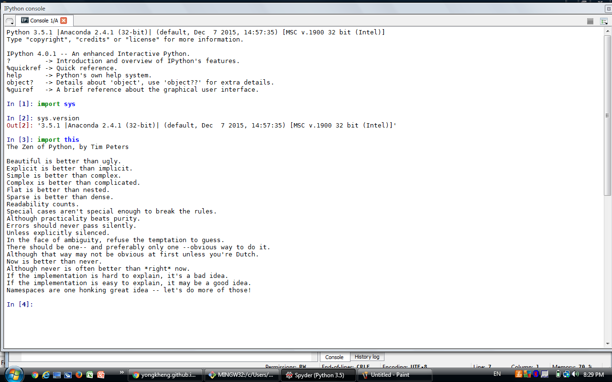

UECM3033 Assignment #1 Report
========================================================

- Prepared by: Jamie Lee Mei Mei
- Tutorial Group: T2

--------------------------------------------------------

## Task 1 -- setup a github repository

The reports, codes and supporting documents are uploaded to Github at: 

https://github.com/JamieLeeMM/UECM3033_assign1.git

---------------------------------------------------------

## Task 2 -- setup python

Put here the screen shot of file (python.png)

------------------------------------------------------------

## Task 3 -- modify and run Python script

In this section, please report:

1. The hexadecimal value of your student ID.
	Student ID        : 1204052
	Hexadecimal value : 0x125f54
2. Write down the definite integrals that you have chosen.
	$$\int_0^{\infty} {20} e^{-x^5} dx = {4}\gamma{\frac{1}{5}} $$

3. Write down your system of 10 linear equations.
	z = np.random.random(100) #create 100 random numbers
	A = np.reshape(z,(10,10)) #100 random numbers into 10x10 matrix form
   	b = np.random.random(10)  #create 10 random numbers
    b = np.reshape(b,(10,1))  #10 numbers into 10x1 matrix form
    x = np.linalg.solve(A,b)  #solve Ax=b

	answer:

	[[ 0.00199653]
	 [ 0.56841984]
	 [ 0.64481871]
	 [-0.13045821]
	 [ 1.29572738]
	 [ 1.7429518 ]
	 [-0.41976513]
	 [-0.21691916]
	 [-0.66197167]
	 [-0.87714676]]

-----------------------------------

last modified: 27 January 2016
